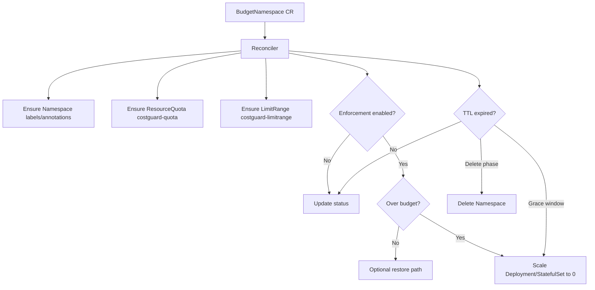

# Architecture

## High-level flow

`BudgetNamespace` is a namespaced CR (usually created in `default`) that targets a managed namespace via `spec.namespaceName`.

## Enforcement sources

Over-budget state is calculated from one or both:

- **ResourceQuota pressure** (`used >= hard` on tracked resources)
- **Cost budget pressure** (BigQuery SUM(cost) in lookback >= `maxSpendUSD`)

The reconciler sets `OverBudget` condition with reason:

- `ResourceQuotaAtOrOverHard`
- `CostBudgetExceeded`
- `CostBudgetAndQuotaExceeded`
- `WithinBudget`

## Hidden/advanced behavior

### Exempt workloads

Workloads are skipped from scale-to-zero if pod template label is set:

- `ealebed.github.io/exempt=true`

### Replica preservation and restore

Before scale-down, previous replicas are saved in annotation:

- `finops.ealebed.github.io/pre-scale-replicas`

If `restoreOnRecovery: true`, the operator restores replicas after:

- budget returns below threshold
- cooldown (`enforcementCooldown`) passes

### Query throttling

Cost queries are throttled by `queryInterval` and cached in status:

- `status.lastCostQueryAt`
- `status.lastObservedSpendUSD`

### Reconcile requeueing

- periodic poll for enforcement state
- ResourceQuota watch triggers fast re-reconcile
- TTL windows use bounded requeues

## BigQuery details

Cost-budget query filters rows by:

- `goog-k8s-cluster-name = spec.costBudget.clusterName`
- `goog-k8s-namespace = spec.namespaceName`

`billingLocation` must match dataset location (e.g. `EU`).

Operator startup also relies on project selection for BigQuery jobs:

- env `GOOGLE_CLOUD_PROJECT` (or `GCLOUD_PROJECT` / `GCP_PROJECT`)
